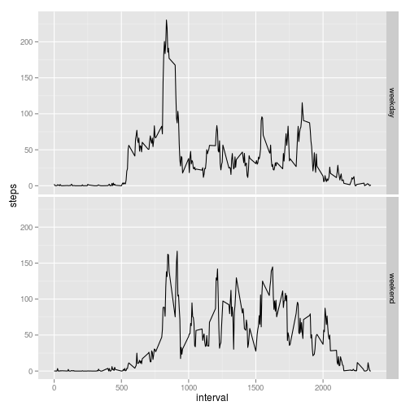

# Reproducible Research: Peer Assessment 1


## Loading and preprocessing the data
- **Assumes activity.zip is present in the working directory.**
- Unzip activity.zip if necessary.
- Load activity.csv into a variable.
- Change the middle column to a date variable.

```r
if (!("activity.csv" %in% list.files())) { unzip("activity.zip") }
activity <- read.csv("activity.csv", header=T, na="NA")
activity$date <- as.Date(as.character(activity$date))
```

## What is mean total number of steps taken per day?
Histogram of the total number of steps taken per day (treating NA as 0).
The NAs have a big effect on this graph because a day that is entirely NAs
will seem to have 0 steps.

```r
daily.totals <- with(activity, tapply(steps, date, FUN=sum, na.rm=T))
hist(daily.totals, xlab="Total steps", ylab="Number of days with this total")
```

 

The mean number of steps per day:

```r
mean(daily.totals, na.rm=T)
```

```
## [1] 9354
```
The median:

```r
median(daily.totals, na.rm=T)
```

```
## [1] 10395
```

Demonstrating embedding these values in a sentence:  
The mean number of steps per day is 9354.2295;
the median is 10395.

## What is the average daily activity pattern?
This code produces a plot that shows the person's average daily pattern.

```r
ave.daily.pattern <- aggregate(steps ~ interval, data=activity, FUN=mean)
library(ggplot2)
qplot(interval, steps, data=ave.daily.pattern, geom="line")
```

 

The interval with the highest average number of steps:

```r
index <- which.max(ave.daily.pattern$steps)
ave.daily.pattern[index,"interval"]
```

```
## [1] 835
```

## Imputing missing values
1. The number of missing values:

```r
sum(is.na(activity$steps))
```

```
## [1] 2304
```
Demonstrating embedding this value in a sentence: The total number
of missing values is 2304.

To impute missing values, I will use the mean for that 5-minute
interval across all the days for which that interval is not NA.
The **imputed** data frame will be equal to **activity**, but with
the missing values filled in.

```r
imputed <- activity
imputed$steps <- as.numeric(imputed$steps) # The imputed means will not be integers.
nas <- which(is.na(imputed$steps)) # The indices of the NA values
indices2 <- nas %% 288 # take mod 288 (only 288 intervals per day)
indices2[indices2 == 0] <- 288
imputed$steps[nas] <- ave.daily.pattern[indices2, "steps"]
head(imputed)
```

```
##     steps       date interval
## 1 1.71698 2012-10-01        0
## 2 0.33962 2012-10-01        5
## 3 0.13208 2012-10-01       10
## 4 0.15094 2012-10-01       15
## 5 0.07547 2012-10-01       20
## 6 2.09434 2012-10-01       25
```

Histogram of total daily steps, using the imputed data set:

```r
imputed.daily.totals <- with(imputed, tapply(steps, date, FUN=sum))
hist(imputed.daily.totals)
```

 

The mean and median steps per day, using the imputed data.
**These are higher than they had been in the non-imputed data set.**

```r
mean(imputed.daily.totals)
```

```
## [1] 10766
```
The median:

```r
median(imputed.daily.totals)
```

```
## [1] 10766
```
## Are there differences in activity patterns between weekdays and weekends?
Constructing a factor variable, **w**, in the **imputed** data set:

```r
imputed$w <- factor(weekdays(imputed$date,T) %in% c("Sat", "Sun"))
levels(imputed$w) <- c("weekday", "weekend")
```

The patterns on weekdays and weekends look different.
Weekdays have a high peak early in the day, during which the
person is probably exercising or hurrying to work.  This is
followed by a fairly sedentary day.  Weekends also have an
early peak, which is lower than that of the weekdays, and the
weekend activity during the rest of the day is higher than on
weekdays.  The person appears to go to bed later on the
weekends than in the weekdays (on average).

```r
patterns <- aggregate(steps ~ interval + w, data=imputed, FUN=mean)
qplot(interval, steps, data=patterns, facets=w ~ ., geom="line")
```

 
